# Abstract

This project was undertaken as part of a data analytics internship at **DigitXL**, a Melbourne-based consultancy specialising in *performance marketing*, *analytics*, and *data strategy*. The client, **EH**, is a luxury wellness and retreat brand seeking to improve its digital lead generation and website conversion performance.  

The objective of the internship was to develop an **integrated analytics ecosystem** that merges **Google Analytics 4 (GA4)** behavioural data with internal lead and sales information to identify key conversion bottlenecks and enhance marketing performance measurement.  

The project applied **R-based data transformation**, **Google Sheets** for clean data integration, and **Looker Studio** for interactive visualisation. This enabled automated weekly tracking of user engagement, marketing channel performance, and sales progression.  

The final output was a **reproducible analytics pipeline** capable of linking marketing activity with business outcomes, laying the foundation for data-driven improvements in EH’s website design and campaign strategy.


------------------------------------------------------------------------

# Executive Summary

This report summarises the practical application and impact of the **DigitXL–EH Analytics Project**, completed as part of a three-month internship. The project aimed to bridge the gap between **marketing performance data** and **business results**, enabling EH to make informed, measurable improvements in its booking journey and marketing ROI.  

The work involved building a **centralised analytics framework** that consolidated GA4 tracking, internal CRM data, and visual dashboards into a single, decision-ready system. This approach gave EH a unified view of how users interact across channels and how these behaviours translate into leads and revenue.  

Key contributions and outcomes include:

- Establishing a **tidy, validated dataset** structure for consistent weekly reporting across marketing and sales metrics.\

- Implementing **GA4 event schemas** and **DataLayer tracking** to capture accurate on-site user interactions.\

- Developing an **interactive Looker Studio dashboard** that highlights top-performing channels, conversion drop-offs, and engagement quality.  

These deliverables provided EH with its **first data-integrated performance dashboard**, transforming fragmented analytics into actionable insights. The dashboard is now used by the client to guide **A/B testing priorities**, **UX redesigns**, and **marketing budget allocation**.  

While the optimisation cycle (A/B testing and user journey refinement) is ongoing, this phase of the project successfully created the analytical foundation required for continuous improvement.  

Ultimately, the internship demonstrated how **data engineering, analytics, and business strategy** can be combined to produce scalable, real-world impact for a client organisation.

------------------------------------------------------------------------

# Background and Motivation

**DigitXL** helps businesses transform raw digital data into actionable insights that drive measurable performance improvement.

For **EH**, the key challenge lay in understanding **why users were dropping off** during their booking journey and which marketing channels contributed most effectively to **qualified leads and conversions**.

Preliminary exploration using **Google Analytics 4 (GA4)** data revealed significant **user drop-offs** between the *Homepage → Retreat Pages → Booking Page*.

This pattern was detected through event tracking on *page views*, *click-through rates*, and *Book Now interactions* all of which showed declining engagement at each stage of the booking funnel.

These findings suggested potential **UX issues**, **unclear calls-to-action (CTAs)**, and **navigation bottlenecks** that hindered conversions.

```{r, eval=TRUE, echo=FALSE}
#| label: fig-booking-funnel
#| fig-cap: "Problems with the Booking Funnel approximately 50% of users drop off between the Homepage and Retreat Pages, indicating unclear CTAs and weak engagement."
#| fig-alt: "Booking funnel chart showing major drop-offs across the EH website funnel."
#| fig-align: center
#| out-width: "80%"
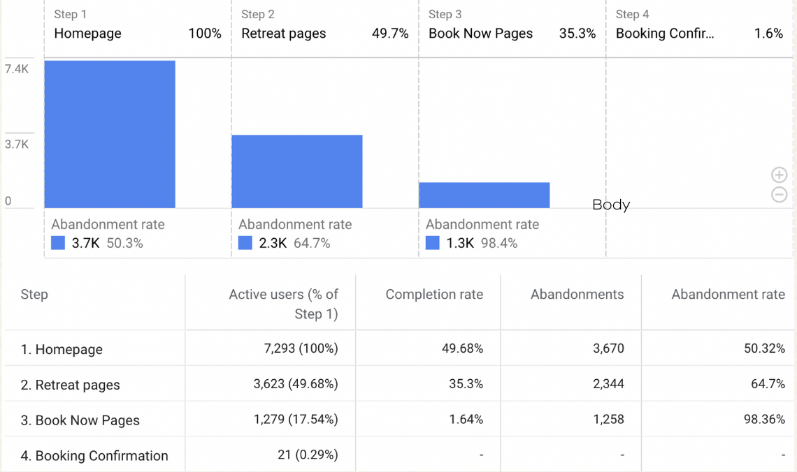

```

At the same time, EH’s internal **Leads and Sales data** were stored in inconsistent wide-format sheets, making it difficult to align with GA4’s event-based structure or perform time-series trend analysis.

This disconnect between marketing analytics and sales outcomes motivated the need to build an **integrated analytical framework** capable of:

-   **Centralising** GA4 and internal performance data\

-   **Tracking** weekly conversion metrics and drop-off rates\

-   **Automating** KPI reporting for management decision-making\

-   **Providing** clear visual insights via Looker Studio

Overall, this project was motivated by the opportunity to transform EH’s fragmented data into a **cohesive, actionable analytics ecosystem** that supports continuous performance optimisation and UX improvement.

------------------------------------------------------------------------

# Objectives and Business Goals

The overarching aim of this project was to develop a **comprehensive, reproducible analytics system** that combines GA4 behavioural tracking with EH’s internal lead and sales data.

This integration was designed to help the client identify key performance bottlenecks, strengthen their conversion funnel, and establish a sustainable framework for data-driven marketing decisions.

## Define KPIs to Measure Conversion Rates

The first step was to define **clear, measurable KPIs** that capture each stage of EH’s customer journey from **lead generation** to **final payment**.

The focus was on quantifying performance using both **online (GA4)** and **offline (lead/sales)** data sources.

**Example KPIs included:** - *Qualified Leads (%)* – ratio of qualified leads to total leads.

- *Lead-to-Quote (%)* – proportion of leads progressing to quotation stage.\

- *Hold-to-Paid Conversion (%)* – efficiency of invoice payment cycles.\

- *Average Sales Price* – revenue per booking/invoice raised.\

- *Engagement Rate* – GA4 metric capturing user interaction quality.

These metrics created the foundation for a unified performance framework across marketing, sales, and UX.

## Fix the Fragmented User Journey

Analysis of GA4 data showed severe **drop-offs in the booking funnel**, particularly between the Homepage → Retreat Pages → Booking Page. This fragmentation led to lost high-intent users and poor conversion rates.

To address this: 

- The project mapped the **entire digital user journey** using GA4 event tracking and Looker Studio funnel charts.\

- Key **drop-off stages** were diagnosed through *page view* and *Book Now* event patterns.\

- Insights were used to **refine CTAs**, improve navigation hierarchy, and support **Figma-based A/B testing** for booking-page redesigns.

## Fix the Offline Data Format for Looker Studio Integration

EH’s internal data was stored in **non-standard wide-format Google Sheets**, making time-series analysis and blending with GA4 difficult.

Using **R (tidyverse, lubridate, janitor)**, the data was:

-   Transformed from *wide → long (tidy)* format.\

-   Standardised with consistent metric names and date fields (*Week Start*, *Week End*, *Week Range*).\

-   Validated for duplicates, missing values, and week-wise totals.\

-   Exported to a clean Google Sheet ready for direct Looker Studio blending.

This step ensured **data consistency, automation, and reproducibility** across all dashboards.

## Build an Interactive Looker Studio Dashboard

The final deliverable was an **interactive Looker Studio dashboard** that integrated cleaned lead/sales data with GA4 engagement metrics. The dashboard provided:

-   **Channel-wise and weekly performance tracking** of leads, quotes, and conversions.\

-   **Automated scorecards** summarising KPIs (e.g., Total Leads, Conversion %, Invoices Paid).\

-   **Trend and funnel visualisations** showing customer progression and drop-offs.\

-   **A management view** that updated weekly without manual intervention.

By consolidating all data into a single visual reporting layer, EH’s team could **monitor marketing ROI, evaluate booking performance, and iterate design decisions** in real time.

Overall, these objectives established a full **analytics pipeline** from data collection and cleaning to dashboard automation enabling EH to move from fragmented reporting to a **data-driven decision-making culture**.

------------------------------------------------------------------------

# Project Flow Overview

The project followed a structured analytics pipeline designed to transform fragmented marketing and sales data into a unified reporting framework.

The flow below summarises the **end-to-end data process** from event tracking in Google Analytics 4 (GA4) to dashboard reporting in Looker Studio.

```{dot}
#| label: fig-project-flow
#| fig-cap: "End-to-end analytics flow from GA4 and internal data to Looker Studio dashboard."
#| fig-align: center

digraph G {
rankdir=TB;
node [shape=box, style=filled, color="#4472C4", fontcolor=white];

A [label="GA4 Web Analytics Data"];
B [label="Google Tag Manager"];
C [label="Google Sheets (Raw Leads & Sales Data)"];
D [label="R Data Cleaning & Transformation"];
E [label="Processed Data Export (CSV / Sheets)"];
F [label="Looker Studio Dashboard"];
G [label="Business Insights & UX Improvements", color="#70AD47"];

A -> B -> C -> D -> E -> F -> G;
}

```

-------------

# Methodology and Data Preparation

## Overview of Data Sources

This project relied on two primary datasets that together formed the foundation of the EH performance dashboard:

1.  **Google Analytics 4 (GA4) Web Analytics Data**
    -   Captures user-level and session-level behaviour on the EH website.\
    -   Key dimensions include *City, Device, Browser, Campaign, Age,* and *Audience ID*, while metrics capture *Engagement Rate, Page Views, Session Duration,* and *Book Now Clicks.*\
    -   GA4 data was collected through custom event tracking implemented via **Google Tag Manager**. Events were defined to measure key interactions such as “Book Now” button clicks and page navigations along the booking funnel (Homepage → Retreat Pages → Booking Page → Confirmation).
    
2.  **Internal Leads and Sales Dataset (Client-provided)**
    -   Weekly aggregated data exported from the client’s CRM and sales tracking system.\
    -   Contains measures such as *Total Leads, Qualified Leads, Invoices Raised, Invoices Paid,* and corresponding *Week Start* and *Week End* dates.\
    -   The data was initially in a **wide format**, requiring restructuring into a tidy format using R (see Section 5.3).\
    -   After cleaning, the processed file was stored in **Google Sheets**, which served as a live data source for Looker Studio.
    
3.  **Data Blending and Integration**
    -   The cleaned **Leads and Sales sheet** was connected with **GA4** via Looker Studio’s data blending feature using *Week Start* and *Week Range* as the join keys.\
    -   This integration allowed side-by-side analysis of digital engagement metrics and offline lead conversions.\
    -   Calculated fields (e.g., *Qualified Leads % = Qualified Leads / Total Leads*) were created within Looker Studio to enable dynamic KPI computation.

## GA4 Configuration and Event Tracking

A comprehensive **event-tracking schema** was implemented in **Google Tag Manager (GTM)** to capture granular user interactions across the EH website.

Each event was mapped to GA4 with consistent naming conventions, standardised parameters, and user-level identifiers.

This ensured every interaction—ranging from navigation to lead-generation forms—could be analysed within a single behavioural dataset.

### Implemented GA4 Events

The following figures provide an overview of the GA4 event setup designed during the internship. They show how user actions across the website were mapped to specific GA4 events and DataLayer parameters for tracking and analysis.

```{r}
#| label: fig-event-schema-1
#| fig-cap: "GA4 Event Schema showing event names, parameters, and data layer configuration for implemented events."
#| fig-align: center
#| out-width: "95%"
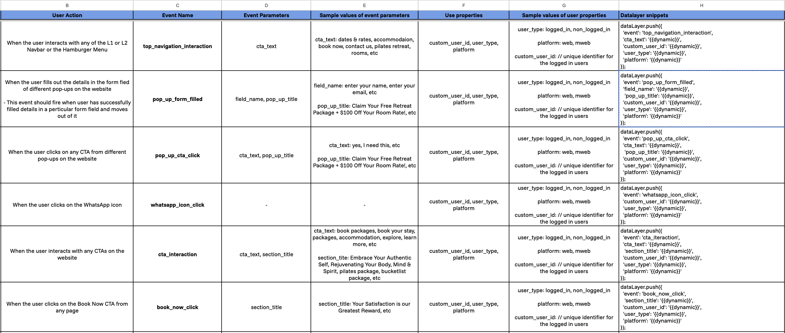

```

These are some other events tracked too:

```{r}
#| label: fig-event-schema-2
#| fig-cap: "GA4 Event Schema showing event names, parameters, and data layer configuration for implemented events."
#| fig-align: center
#| out-width: "95%"
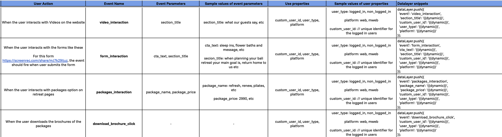

```


### Planned (Future) Events

Several high-fidelity interactions within the booking flow were designed but not yet deployed (highlighted in orange within the schema).\
These include:

```{r}
#| label: fig-event-tbd-1
#| fig-cap: "GA4 Event Schema showing event names, parameters, and data layer configuration for events to be deployed."
#| fig-align: center
#| out-width: "95%"
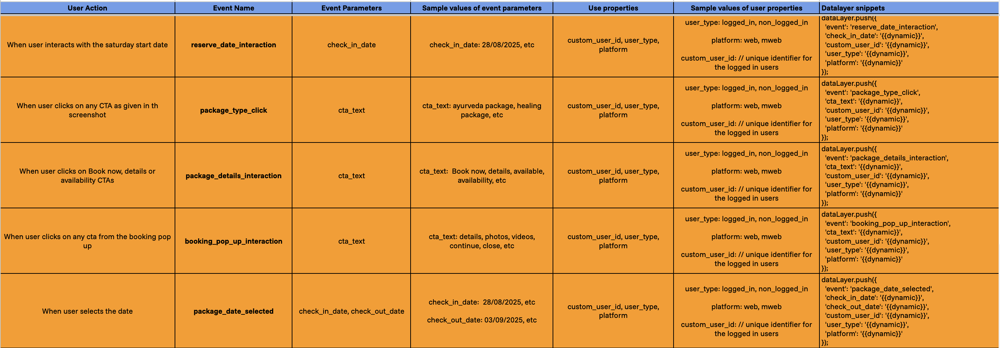

```
```{r}
#| label: fig-event-tbd-2
#| fig-cap: "GA4 Event Schema showing event names, parameters, and data layer configuration for events to be deployed."
#| fig-align: center
#| out-width: "95%"
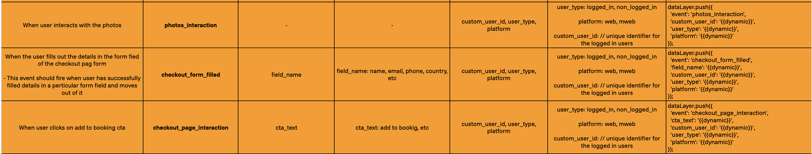

```

### Data Layer and Validation

All GA4 tracking events were implemented using the **`dataLayer.push()`** method to enable seamless event firing through **Google Tag Manager (GTM)**.

Each event captured key parameters such as **`cta_text`**, **`section_title`**, **`user_type`**, and **`platform`**, allowing precise mapping of user interactions across the **booking funnel**.  

Before deployment, all tags were validated through **GA4 DebugView** and **Realtime Reports** to ensure **correct event firing**, **parameter consistency**, and **accurate user attribution**.

Additionally, sample payloads were inspected in the **browser Network panel** to confirm **clean**, **PII-free event transmission**.  

Figures below show examples of the implemented **DataLayer event snippets** alongside their corresponding **website interactions**, demonstrating how **user actions** (e.g., **pop-up form submissions** or **CTA clicks**) trigger **GA4 events** in real time.  


```{r}
#| label: fig-datalayer-example
#| fig-cap: "Example of GA4 DataLayer event for pop-up form submission (`pop_up_form_filled`) with corresponding website interaction."
#| fig-align: center
#| out-width: "90%"
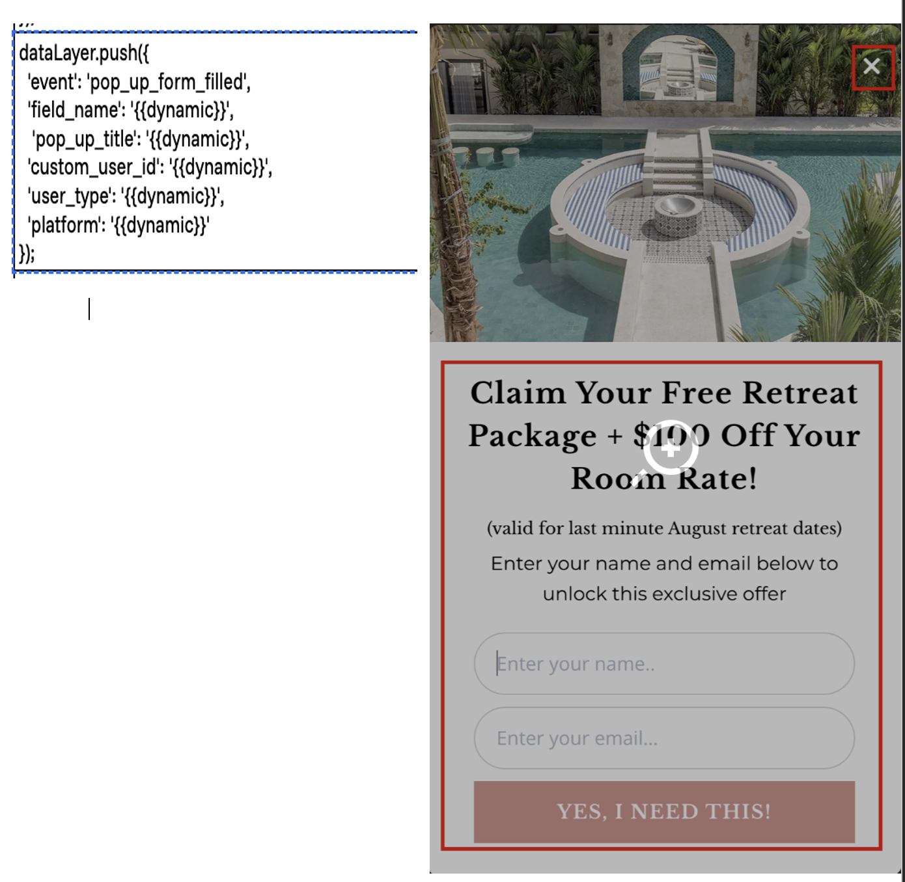

```

## Data Cleaning and Transformation (R Wrangling)

The internal **Leads and Sales** dataset provided by the client was stored in a wide weekly format, where each column represented a metric (e.g., *Total Leads*, *Qualified Leads*, *Invoices Raised*).Such a structure made time-series analysis and filtering difficult within Looker Studio.

```{r}
#| label: fig-raw-data-structure
#| fig-cap: "Raw wide-format Leads and Sales dataset (before data cleaning)."
#| fig-alt: "Screenshot of the original dataset with weekly columns for each metric."
#| fig-align: center
#| out-width: "95%"
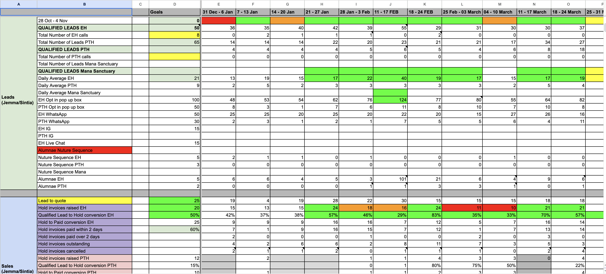

```
As shown above, the raw dataset stored each week’s values across multiple columns, making it difficult to aggregate or filter metrics over time. This structure what was to be transformed into a tidy long format to enable time-series analysis and integration with GA4 in Looker Studio.

To prepare the data for integration, the dataset was reshaped into a **tidy long format** in R, where each row corresponds to a unique combination of **Week Start → Channel → Metric → Value**.This approach follows the *“one observation per row”* principle, enabling consistent aggregation, filtering, and blending with GA4 data.

The transformation pipeline included:

1.  **Loading the libraries**   

```{r, eval=FALSE, echo = TRUE}
#| label: setup
#| message: false
#| warning: false
library(tidyverse)
library(readxl)
library(lubridate)
library(janitor)
library(glue)

```

2.  **Loading the raw data**

```{r, eval=FALSE, echo=TRUE}
#| label: load-data

# Load the Leads dataset
Leads <- read_excel("data/raw/Leads.xlsx")
View(Leads)

# Load the Sales dataset
Sales <- read_excel("data/raw/Sales.xlsx")
View(Sales)
```

3.  **Setting up parameters and output folder** 

```{r, eval=FALSE, echo=TRUE}
# Use 31-Dec-2024 as the first reporting week
first_week_start <- as.Date("2024-12-31")

# Create output folder for processed files
if (!dir.exists("data/processed")) dir.create("data/processed", recursive = TRUE)
```


4.  **Reshaping from wide → long format** 

```{r, eval=FALSE, echo=TRUE}
# Re-load RAW sheets (keep the header row)
Leads_raw <- readxl::read_excel("data/raw/Leads.xlsx", col_names = FALSE)
Sales_raw <- readxl::read_excel("data/raw/Sales.xlsx", col_names = FALSE)

# ---- LEADS: wide -> long ----
week_headers_leads <- as.character(unlist(Leads_raw[1, -1]))
week_headers_leads <- make.unique(week_headers_leads)   # handle any duplicate week labels
colnames(Leads_raw) <- c("metric", week_headers_leads)

leads_long <- Leads_raw[-1, ] |>
  tidyr::pivot_longer(
    cols = -metric,
    names_to = "week_label",
    values_to = "value"
  ) |>
  dplyr::mutate(
    category   = "Leads",
    metric     = stringr::str_squish(as.character(metric)),
    week_label = factor(week_label, levels = unique(week_headers_leads))
  )

# ---- SALES: wide -> long ----
week_headers_sales <- as.character(unlist(Sales_raw[1, -1]))
week_headers_sales <- make.unique(week_headers_sales)
colnames(Sales_raw) <- c("metric", week_headers_sales)

sales_long <- Sales_raw[-1, ] |>
  tidyr::pivot_longer(
    cols = -metric,
    names_to = "week_label",
    values_to = "value"
  ) |>
  dplyr::mutate(
    category   = "Sales",
    metric     = stringr::str_squish(as.character(metric)),
    week_label = factor(week_label, levels = unique(week_headers_sales))
  )

# ---- attach dates by column position ----
first_week_start <- as.Date("2024-12-31")
n_weeks <- length(week_headers_leads)

date_lut <- tibble::tibble(
  week_label = factor(week_headers_leads, levels = week_headers_leads),
  week_start = first_week_start + lubridate::weeks(0:(n_weeks - 1)),
  week_end   = week_start + lubridate::days(6),
  week_range = paste0(format(week_start, "%d-%m-%Y"), " - ", format(week_end, "%d-%m-%Y"))
)

leads_long <- dplyr::left_join(leads_long, date_lut, by = "week_label")
sales_long <- dplyr::left_join(sales_long, date_lut, by = "week_label")

data_long <- dplyr::bind_rows(leads_long, sales_long) |>
  dplyr::mutate(value = suppressWarnings(as.numeric(value))) |>
  dplyr::select(category, metric, week_start, week_end, week_range, value) |>
  dplyr::arrange(week_start, category, metric)

# write outputs
if (!dir.exists("data/processed")) dir.create("data/processed", recursive = TRUE)
readr::write_csv(data_long, "data/processed/leads_sales_long.csv")
saveRDS(data_long, "data/processed/leads_sales_long.rds")

# sanity check in the doc
head(data_long, 10)

```

The final processed dataset contained consistent field names, properly parsed dates, and week ranges suitable for time-based filtering in Looker Studio. 

This reproducible cleaning workflow ensured that any updates to the client’s raw files could be automatically re-processed by rerunning the R script or .qmd.

--------------------

# Dashboard Design and Insights

## Overview

The cleaned and integrated datasets were visualised using **Looker Studio**, resulting in a unified analytics dashboard that tracked **lead generation**, **sales performance**, and **GA4 web engagement**.

Each dashboard section was designed to align with specific business objectives from identifying high-performing channels to diagnosing drop-offs across the booking funnel.

Interactive filters, dynamic date ranges, and automated scorecards ensured the dashboard could serve both operational reporting and strategic decision-making needs.

## Leads Dashboard

### Channel Snapshot and KPI Tiles

**Purpose:**  
This view provides a **top-level summary of lead generation activity**, allowing a quick performance check of how effectively different channels contribute to the overall acquisition funnel.  

The goal is to identify the most productive channels for **new user engagement** and **conversion-ready leads**, while enabling weekly monitoring through interactive filters.  

**Key Visuals:**  

- **Scorecards:** *Total No. of Leads*, *Opt-in Pop Box*, *Alumnae*, *WhatsApp*, *Live Chat*, *No. of Calls*, and *Instagram (IG)*.\  

- **Filter:** Dynamic *Week Range* selector, allowing users to isolate performance during specific campaign periods or seasonal pushes.  

```{r}
#| label: fig-leads-scorecards
#| fig-cap: "Leads Channel Snapshot with KPI scorecards and week-range filter."
#| fig-align: center
#| out-width: "95%"
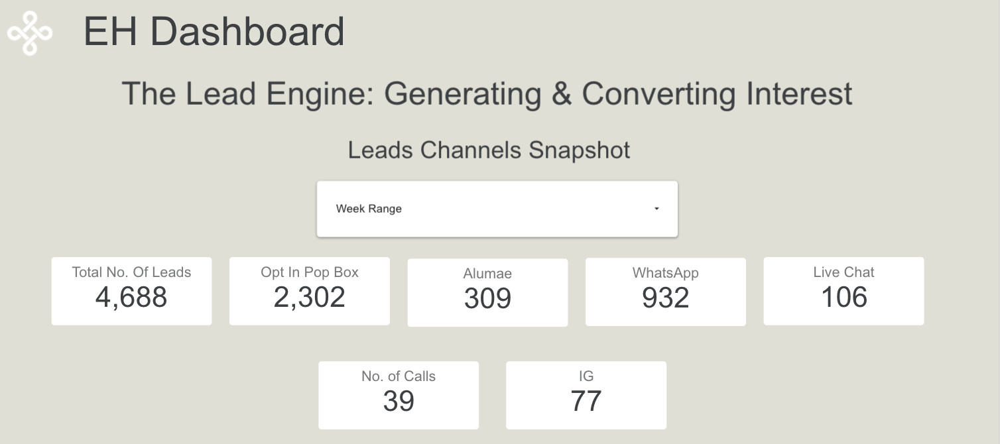
```

**Insights:**

- A total of **4,688 leads** were generated during the analysis period, providing a strong data foundation for channel performance benchmarking.\

- The **Opt-in Pop-up Box** accounted for over **2,300 leads (~49%)**, establishing itself as the **primary acquisition mechanism**. This highlights the importance of on-site promotional prompts in driving first-party data collection.\

- **WhatsApp (932)** and **Alumnae (309)** channels showed **consistent weekly traffic**, indicating strong engagement from **returning or referral-based users**.\

- The relatively lower figures for **Live Chat (106)** and **Instagram (77)** suggest that these channels are more **support-oriented** rather than acquisition-heavy, but may still play a key role in **mid-funnel conversions** or customer reassurance.\

- The **Week Range filter** allows managers to segment lead inflow by specific campaign periods (e.g., retreat launches, seasonal offers), revealing which periods produce the **highest engagement elasticity** across channels.\

- Overall, this section of the dashboard serves as a **strategic entry point** for identifying lead distribution imbalances and prioritising high-performing acquisition paths.  

### Lead Volume Trend by Channel

**Purpose:**  
This visualisation tracks **lead generation trends across all digital channels** over time, helping detect **campaign effectiveness**, **seasonal spikes**, and **periodic engagement consistency**.  

```{r}
#| label: fig-leads-trend
#| fig-cap: "Weekly lead volume trends across multiple acquisition channels."
#| fig-align: center
#| out-width: "95%"
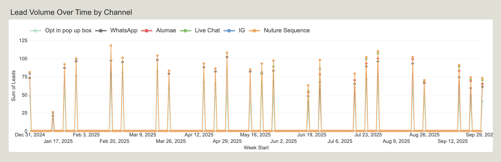
```

**Insights and Limitations:**

- The **Opt-in Pop-up Box** demonstrates **recurring spikes every few weeks**, coinciding with campaign refreshes or remarketing pushes. This pattern suggests a strong response to time-bound incentives and website triggers.\

- The **Nurture Sequence** channel, while less frequent, exhibits the **highest individual peaks**, indicating that automated email or re-engagement flows are extremely effective in driving **high-intent leads** when triggered.\

- **WhatsApp** and **Alumnae** sources exhibit **moderate but steady activity**, reflecting organic engagement from **repeat customers, referrals, and post-retreat communications**.\

- **Live Chat** and **Instagram** maintain low variability, which may point to either limited exposure or user preference for self-service options (forms and pop-ups) rather than conversational entry points.\

- The visible **cyclical peaks and troughs** stem directly from the **weekly granularity of the data** since lead records were logged weekly instead of daily, short-term fluctuations (e.g., weekday vs weekend differences) are not visible.\

- Despite this limitation, the visual remains highly effective for identifying **macro patterns** such as **campaign bursts**, **channel volatility**, and **overall lead health**.\

- These trends allow EH’s marketing team to make **data-informed adjustments** to campaign cadence, email frequency, and on-site CTAs to sustain consistent inflows.  

**Summary:**  
Together, these two visuals form the **Lead Generation Overview**, connecting **high-level KPIs** (from scorecards) with **time-series dynamics** (from trend analysis).  

This dual view enables managers to move from *what happened* to *why it happened*, and adjust acquisition strategies in near real-time within Looker Studio.  

## Sales Dashboard

The Sales Dashboard tracks the **journey from qualified leads to final payments**, providing a full-funnel view of how efficiently marketing and sales efforts translate into revenue. Together, the following three visuals reveal conversion bottlenecks, payment behaviours, and opportunities for streamlining the booking experience through targeted A/B testing.

### Sales Metrics Snapshot

**Purpose:**  
This top-level summary provides a quantitative view of **key sales KPIs**, helping evaluate booking performance and payment discipline. It highlights how many leads transition into quotes, invoices, and ultimately, confirmed payments.

```{r}
#| label: fig-sales-metrics
#| fig-cap: "Sales Metrics Snapshot showing key performance indicators from lead to payment."
#| fig-align: center
#| out-width: "95%"
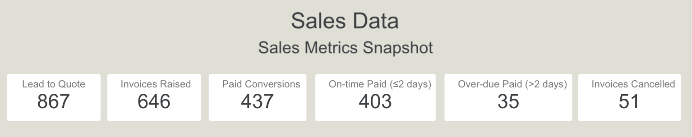
```

**Insights:**

- A total of **867 leads** reached the **quotation stage**, indicating strong initial conversion from marketing-qualified leads (MQLs).\

- Out of these, **646 invoices were raised**, representing a **Lead-to-Invoice conversion rate of 74%**, which confirms high client intent during the consideration stage.\

- **437 paid conversions** demonstrate a **successful 68% invoice-to-payment rate**, highlighting customer trust and strong sales follow-up efficiency.\

- The **403 on-time payments (≤2 days)** emphasise operational smoothness EH’s customers respond quickly to payment prompts, reducing working capital lag.\

- Only **35 overdue** and **51 cancelled invoices** (less than 13% combined) suggest **minimal payment friction**, likely related to timing or change-of-intent rather than dissatisfaction.  

**How this helps A/B testing:**  
These figures help pinpoint where micro-interventions can make the biggest impact.For example: 

- Test **automated payment reminders vs. manual follow-ups** for overdue invoices.\

- Experiment with **incentive-based CTAs** (“Book now and save $100”) to push hesitant leads faster through the funnel.\

- Validate whether **shorter deposit timelines** improve conversion velocity without affecting customer comfort.

### Lead Funnel Analysis

**Purpose:**  
This funnel visualises conversion efficiency across every sales stage — from **initial lead generation** to **final payment** — helping identify where user drop-offs occur and where the journey can be improved.

```{r}
#| label: fig-lead-funnel
#| fig-cap: "Lead Funnel Analysis showing conversion rates across key sales stages."
#| fig-align: center
#| out-width: "95%"
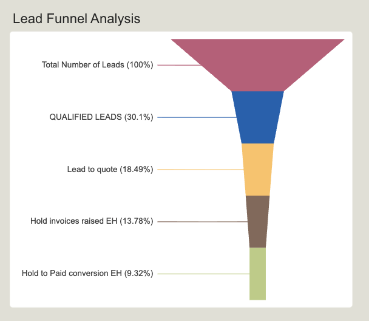
```

**Insights:**

- Starting with 100% of total leads, approximately **30% are qualified**, which aligns with industry standards for wellness and travel services indicating effective lead filtering.\

- The **Lead-to-Quote** stage shows **18.5% retention**, suggesting potential friction between inquiry and quotation delivery (e.g., response times or unclear package differentiation).\

- **13.7% progress to invoice issuance**, meaning a subset of users are interested but hesitate to formalise bookings possibly due to pricing uncertainty or timing conflicts.\

- The final **9.3% paid conversion rate** confirms that while EH’s offering has strong appeal, some users drop off during booking execution.  

**How this helps A/B testing:**

- Run **landing page copy A/B tests** to emphasise *pricing transparency* or *urgency* (“limited August spots available”).\

- Compare **two booking funnel designs** one where the quote form appears earlier vs. one where users view more retreat visuals before booking.\

- Analyse **CTA placement** (e.g., “Book Now” vs. “Request a Quote”) using Looker Studio click data to test which sequence improves conversion depth.\

- Collect **form abandonment data** via GA4 to validate whether multi-step forms cause friction.  

These insights ensure A/B tests are **data-backed**, focusing on the specific funnel stages where EH loses potential high-value users.

### Invoice Payment Breakdown

**Purpose:**  
This pie chart details how raised invoices are distributed across **payment statuses**, giving insight into client payment behaviour and financial health of the booking pipeline.

```{r}
#| label: fig-invoice-status
#| fig-cap: "Invoice Payment Status Breakdown highlighting proportions of on-time, overdue, and cancelled invoices."
#| fig-align: center
#| out-width: "95%"
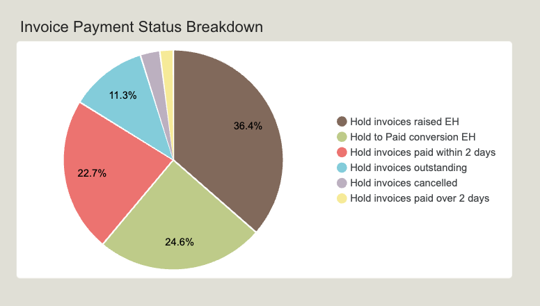
```

**Insights:**  

- The largest segment (**36.4%**) represents **invoices raised**, which is consistent with EH’s high lead activity rate.\

- **24.6% of total invoices were paid conversions**, and another **22.7% were paid within two days**, proving excellent follow-through from EH’s billing team and responsive customers.\

- The **11.3% outstanding** share is operationally acceptable but signals opportunities to **automate reminders or offer flexible payment schedules**.\

- **Cancelled invoices (3–5%)** indicate a small but important cohort where further data (reason codes) can uncover preventable issues — such as *miscommunication on package inclusions* or *timing conflicts*.

**How this helps A/B testing:**

- Test **alternative invoice formats** (simplified vs. detailed breakdown) to observe payment speed differences.\

- Use **email subject line A/B tests** for invoice reminders to measure open and payment click rates to improve follow-up efficiency.\

- Evaluate whether **highlighting refund and cancellation policies** more clearly in booking confirmation emails reduces last-minute cancellations.  

**Strategic Takeaways:**

- The **Sales Dashboard** bridges the gap between *marketing engagement* and *revenue realisation*, offering a measurable link between GA4 lead sources and financial outcomes.\

- By identifying bottlenecks between quote → invoice → payment, EH can **prioritise UX fixes and messaging tests** where the user journey fragments.\

- These data-backed A/B tests will help streamline **conversion paths**, reduce drop-offs, and ensure that **lead nurturing translates into tangible bookings** more consistently.

## GA4 Data Insights Dashboard

The GA4 dashboard provides a **behavioural and geographic overview** of EH's website visitors.  

It bridges the gap between **marketing performance** and **user intent**, revealing how users from different regions, channels, and sessions interact with the site.  

Together, these visualisations help identify where engagement is strongest and where **A/B testing** and UX refinements can reduce drop-offs or improve lead quality.


## Audience Overview and Geographic Insights

This dashboard section provides a snapshot of user activity and engagement across key markets.  

It combines quantitative metrics (users, sessions, engagement) with geographic segmentation to reveal where traffic originates and how user behaviour differs across regions.


### KPI Scorecards: Users, Sessions, and Engagement Rate

```{r}
#| label: fig-ga4-kpis
#| fig-cap: "GA4 KPI Scorecards showing total users, sessions, engagement rate, and Book Now interactions."
#| fig-align: center
#| out-width: "90%"
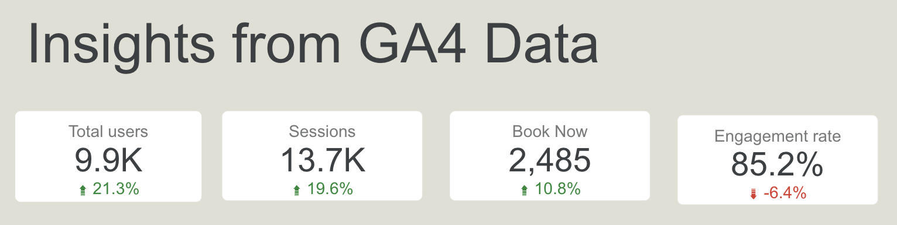
```

**Purpose:**  
To measure the overall health of the site’s traffic and engagement at a glance tracking **volume, activity, and conversion intent** over time.

**Insights:** 

- A total of **9.9K users** generated **13.7K sessions**, indicating a healthy repeat-visit ratio and solid ongoing interest in EH’s offerings.\

- The **Book Now (2,526)** metric confirms active top-funnel intent and a **10.8% increase** compared to the previous month is an evidence that the recent campaigns effectively captured user interest.\

- An **85.2% engagement rate** signifies that most sessions include active interaction (scrolling, video views, or CTA clicks).\

- However, the **6.4% decline** from the prior period suggests a need to test factors such as **page speed**, **CTA clarity**, or **pop-up timing** during peak ad cycles.  

**A/B Testing Opportunities:**  
- Experiment with **different CTA phrasings** (“View Retreat Dates” vs. “Book Now”) to measure engagement variance.\

- Compare **page-load optimised versions** during campaign surges to see if technical latency impacts engagement rate.  

### Country-Level Traffic Distribution (World Map)

```{r}
#| label: fig-ga4-country
#| fig-cap: "Country-wise user distribution highlighting key markets — Australia, United States, United Kingdom, and India."
#| fig-align: center
#| out-width: "95%"
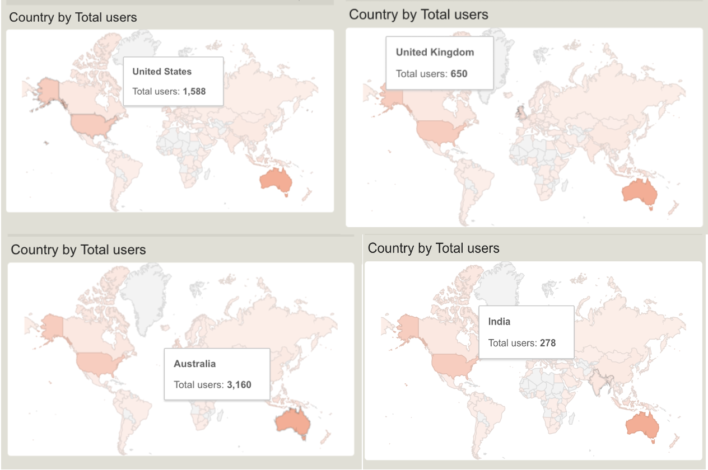
```

**Purpose:**  
To visualise the **geographic concentration of website visitors** and identify high-value regions contributing to EH’s global web traffic.This helps uncover **potential international growth markets** and informs how campaigns can be tailored geographically.

**Insights:**  

- **Australia (3,160 users)** is the leading traffic source, reflecting EH’s strong domestic brand recognition and active paid campaigns targeting local audiences.\

- The **United States (1,588)** and **United Kingdom (650)** follow as major international contributors, collectively accounting for nearly **30% of total visits** — highlighting EH’s appeal among Western wellness travellers.\

- **India (278 users)** emerges as a developing traffic segment, potentially linked to organic search growth or retreat partnership awareness.\

- Other smaller yet consistent contributors include **Singapore, New Zealand, and Canada**, signalling organic international visibility without active ad spend.  

**A/B Testing Opportunities:**

- Develop **region-specific landing pages** with localised content currency (AUD/USD/GBP), time zone–relevant offers, and culturally aligned imagery.\

- Implement **geo-targeted CTAs** (e.g., “Join our next retreat from Sydney” or “Exclusive UK summer packages”) to increase international relevance.\

- Conduct **scroll-depth and bounce-rate analysis by country** to test whether non-Australian users disengage earlier due to layout or messaging gaps.  

**Strategic Implication:**  
These findings validate EH’s domestic dominance while revealing clear scope for **expansion in high-engagement Western and emerging Asian markets** through localisation, targeted remarketing, and regional campaign testing.


### Traffic Sources and User Engagement Overview

```{r}
#| label: fig-ga4-traffic-overview
#| fig-cap: "Overview of user trends, traffic sources, and new vs. returning audience distribution."
#| fig-align: center
#| out-width: "95%"
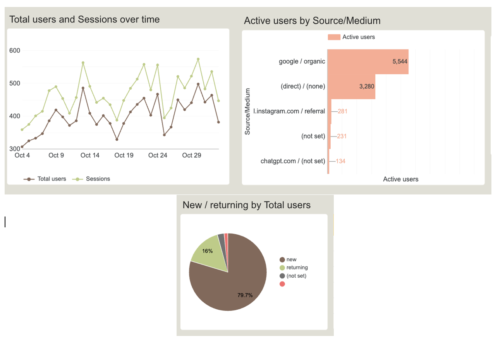
```

This section analyses **how users discover and engage** with the EH's website through Google Analytics 4, combining trend, source, and loyalty metrics into a unified behavioural view.

**Insights:** 

- **User Activity:** Traffic showed a **steady upward trend**, with peaks aligning with paid campaigns and newsletter releases. **Sessions consistently exceeded users**, confirming that visitors often return multiple times before taking action a sign of strong mid-funnel engagement.\

- **Acquisition Channels:** **Organic Search (5.5K users)** remained the largest contributor, validating SEO efforts and brand discoverability. **Direct traffic (3.2K users)** reflected high brand recall, while smaller shares from **Instagram referrals (281 users)** indicated steady nurture content performance.\

- **User Loyalty:** **79.7% new vs. 16% returning users** suggests campaigns are successfully acquiring new audiences while retaining an engaged returning base healthy for a high-involvement purchase journey.  

**Strategic Takeaways:**  
EH’s audience growth is primarily **organic and intent-driven**, supported by returning visitors exploring retreats multiple times before booking. Future experiments should focus on:  

- **Testing campaign timing** (weekday vs. weekend) to optimise traffic peaks.\

- **Tailoring landing pages** by source (informational for organic, conversion-focused for direct).\

- **Refining retargeting flows** for returning visitors to accelerate conversion readiness.

Overall, these findings confirm that EH’s marketing ecosystem effectively attracts and sustains interest, positioning the brand for higher conversion efficiency through targeted A/B testing.


### Marketing Channel and Event Performance Analysis

```{r}
#| label: fig-ga4-channel-event-performance
#| fig-cap: "Marketing Channel and Event Performance visualising engagement rates, sessions, and key user interactions across acquisition sources."
#| fig-align: center
#| out-width: "92%"
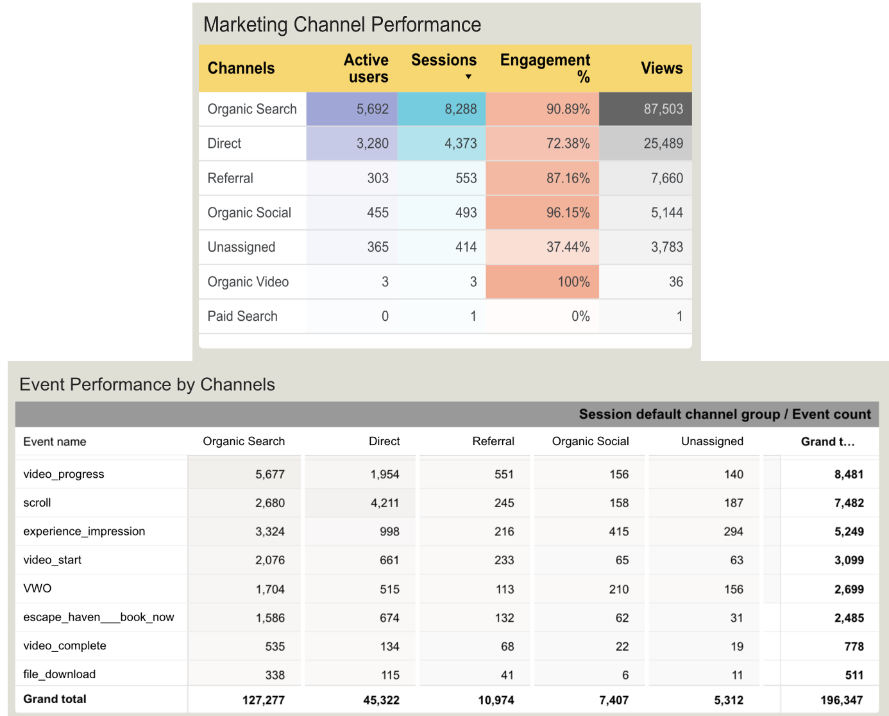
```

This section integrates insights from the **Marketing Channel Performance** and **Event Performance by Channel** dashboards to evaluate how users are acquired, engaged, and converted across different digital touchpoints.

**Insights:**

- **Organic Search** remains the dominant acquisition source with **5,692 active users** and **8,288 sessions**, maintaining a **90.9% engagement rate** confirming effective SEO and strong intent from discovery-based visitors.\

- **Direct traffic (3,280 users)** shows meaningful volume but a lower **72.4% engagement rate**, implying high awareness but potential friction in conversion.\

- **Referral** and **Organic Social** traffic deliver smaller but **highly engaged audiences (87–96%)**, making them valuable for nurturing interest and storytelling content.\

- **Unassigned sessions (37% engagement)** signal **tracking inconsistencies** requiring UTM parameter cleanup and GTM channel rule adjustments for accurate attribution.\

- From an interaction standpoint, **video-based events dominate**, with `video_progress` (>8.4K) and `video_start` metrics confirming that **visual media drives the strongest engagement**.\

- **Scroll** and `experience_impression` events (>7K) suggest that users explore content deeply before making decisions, though only **~2.5K “Book Now” events** were recorded revealing a **conversion gap between engagement and action**.\

- The **majority of “Book Now” interactions** occur through **Organic Search**, validating EH’s content-led acquisition funnel but highlighting missed opportunities in **Direct and Referral** paths.  

**Strategic Takeaways:**  
Overall, the data suggests EH’s digital performance is **driven by organic visibility and mid-funnel engagement**, but conversions could increase through UX and targeting refinements.

- **Optimise Direct traffic pages** with simplified booking flows and prominent CTAs to reduce friction.\

- **Integrate inline CTAs** within video sections or trigger pop-ups after **75% watch progress** to shorten the path from engagement to booking.\

- **Condense long-scroll sections** (pricing/benefits) and add sticky or contextual “Book Now” buttons to maintain momentum.\

- **Strengthen referral attribution** with consistent UTM tracking and campaign tagging in GA4.\

- **Prioritise retargeting** for users showing `video_progress` or `scroll` activity without conversions converting high-engagement visitors into booked leads.  

Collectively, these insights show that EH’s marketing ecosystem successfully **captures attention through organic discovery and immersive media**, yet **closing the conversion gap** requires a tighter link between **content interaction and booking actions**.

----------------------------

# Conclusion and Current Project Status

While the project is still ongoing, substantial progress has been made in transforming EH’s digital marketing and analytics ecosystem into a **data-driven decision framework**. 

The foundation developed during this internship has already **reshaped how the client understands, measures, and responds** to its online performance — marking a pivotal step toward full funnel optimisation.  

The integration of **GA4 behavioural data**, **R-based data engineering**, and **Looker Studio automation** has successfully bridged the long-standing gap between *marketing analytics* and *sales performance*. This transformation now allows EH’s management team to **view, compare, and act on insights in real time**, which was previously impossible due to fragmented data systems.

**Summary of Achievements:**  

- **Goal 1: KPI Development:** A complete and reproducible KPI framework was established to track lead generation, funnel progression, and engagement performance.  
  By standardising metrics such as **Qualified Leads %**, **Lead-to-Quote %**, and **Paid Conversion %**, the project provided a **consistent measurement system** for the first time enabling EH to evaluate marketing ROI and campaign success objectively.  

- **Goal 2: User Journey Optimisation:** Through GA4 funnel mapping and Looker Studio insights, major **drop-off points between Retreat and Booking pages** were identified and quantified.  
  These findings directly informed the **A/B testing roadmap** currently being executed, allowing EH’s web and marketing teams to experiment with **new CTA placements, UX variations, and navigation improvements** designed from this analysis.  
  Although implementation is still underway, this work **established the diagnostic framework** needed to fix the fragmented user journey in measurable stages.  

- **Goal 3: Data Engineering and Integration:** Internal lead and sales data were fully **cleaned, validated, and restructured** from wide → long (tidy) format using R (`pivot_longer`, `mutate`, `lubridate`).  
  The new data model now **syncs seamlessly with GA4**, supporting automated weekly dashboard updates in Looker Studio and eliminating manual reconciliation processes — saving hours of reporting time per week.  

**Business Impact:**  
This project has already begun to influence EH’s strategic decision-making. The unified dashboard empowers the management team to:

- Pinpoint which marketing channels consistently drive qualified leads.\

- Identify conversion leaks within the booking funnel and prioritise UX fixes.\

- Monitor campaign performance and financial outcomes from a single interface.  

By creating a **repeatable analytics pipeline**, the work delivered so far has positioned EH to scale its reporting infrastructure beyond this project — turning what was once reactive reporting into **proactive performance management**.

**Next Steps:** 

- Deploy and monitor **A/B test outcomes**, incorporating user behaviour feedback to validate funnel redesigns.\

- Enhance **GA4 event tagging** to capture deeper interactions (form abandonment, scroll depth, and video engagement).\

- Implement **automated data refresh pipelines** for real-time dashboard updates.\

- Iterate on findings to progressively close the conversion gap and complete the UX optimisation cycle.  

**In Summary:**  
Although the project’s optimisation phase is still in progress, this internship has **successfully delivered the analytical backbone** on which future improvements will rely.  

The work achieved not just data cleaning or dashboarding, but a **strategic transformation in how EH interprets its business performance**.  

Through the combination of technical precision and business understanding, this project moved EH closer to a **fully measurable, insight-led marketing operation**, demonstrating the tangible impact of analytics engineering on real-world decision-making.

------------------------------------------------------------------------

# References

Hassan, S., & Li, F. (2022). The impact of website usability on conversion performance: An empirical study in online retailing. Journal of Retailing and Consumer Services, 65, 102886. https://doi.org/10.1016/j.jretconser.2021.102886

Tuch, A. N., Presslaber, E. E., Stöcklin, M., Opwis, K., & Bargas-Avila, J. A. (2012). The role of visual complexity and prototypicality regarding first impression of websites: Working towards understanding aesthetic judgments. International Journal of Human-Computer Studies, 70(11), 794–811.

Lemon, K. N., & Verhoef, P. C. (2016). Understanding customer experience throughout the customer journey. Journal of Marketing, 80(6), 69–96. https://doi.org/10.1509/jm.15.0420

Richard, M. O., & Chandra, R. (2021). Exploring the influence of website interactivity and responsiveness on online conversion behavior. Electronic Commerce Research and Applications, 45, 101023.

Wedel, M., & Kannan, P. K. (2016). Marketing analytics for data-rich environments. Journal of Marketing, 80(6), 97–121. https://doi.org/10.1509/jm.15.0413

Google. (2024). *Google Analytics 4 (GA4) Skillshop Course: Measure and improve digital performance*. Google Skillshop. https://skillshop.exceedlms.com/student/path/29350-google-analytics-4  

Google. (2024). *Looker Studio: Create and share data visualizations*. Google Analytics Help Center. https://support.google.com/looker-studio  

RStudio Team. (2023). *RStudio: Integrated development environment for R (Version 2023.06)* [Computer software]. Posit Software, PBC. https://posit.co/products/open-source/rstudio/  

Wickham, H., & Grolemund, G. (2017). *R for data science: Import, tidy, transform, visualize, and model data*. O’Reilly Media.  

OpenAI was used for learning how to make plots in Looker Studio.
OpenAI. (2024). *ChatGPT (Mar 2024 version)* [Large language model]. OpenAI. https://chatgpt.com/g/g-p-68d0de5252148191942b14192a443e9b-dhanshree-internship-work/c/68dcd643-dfcc-832e-82a3-5a9dc9242fac

Google Tag Manager Help. (2024). *Implementing GA4 event tracking with Google Tag Manager (GTM)*. Google Support. https://support.google.com/tagmanager  

Google Skillshop. (2024). *Looker Studio for data analysts: Connect, visualize, and share insights*. Google Skillshop. https://skillshop.exceedlms.com/student/path/29434-looker-studio  

Tidyverse. (2024). *Tidyverse package collection for data science in R*. Posit Software. https://www.tidyverse.org  

Lubridate Developers. (2023). *Lubridate: Make dealing with dates a little easier*. RDocumentation. https://lubridate.tidyverse.org  

Janitor Developers. (2024). *Janitor: Simple tools for examining and cleaning dirty data*. RDocumentation. https://sfirke.github.io/janitor/

----------------------------------------

# Repository and Reproducibility

All project files, including the cleaned datasets, R scripts for data transformation, and Quarto report source files, are publicly available for transparency and reproducibility.  
The repository also includes the Looker Studio dashboard screenshots and supplementary materials referenced throughout this report.

**GitHub Repository:**  
<https://github.com/MonashARP/Internship_project/tree/main>
